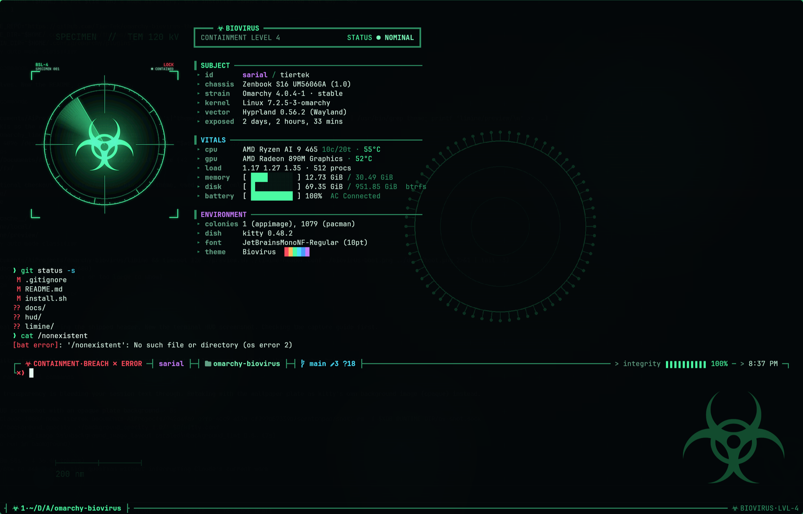
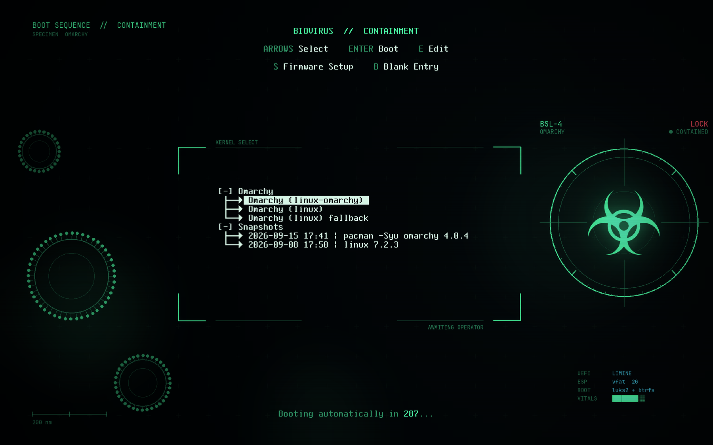

# BioVirus — the animated suite

The [BioVirus theme](https://github.com/TierTek/omarchy-biovirus-theme) is a
set of still plates. This repo is everything else: four QML scenes that run
under the desktop wallpaper and the lock screen, a wallpaper that changes at
every login, a matching SDDM login greeter, a Limine boot menu, and a
"containment HUD" for the terminal — starship prompt, kitty tab bar, fastfetch.
Everything on the desktop is drawn in-process by Omarchy's own Quickshell
shell — no `swww`, no `mpvpaper`, no video files.

| Plate | Scene |
|---|---|
| `biovirus-virions` | drifting virion field |
| `biovirus-mitosis` | cells dividing |
| `biovirus-sequencer` | DNA sequencer read-out (about twice the CPU of the others) |
| `biovirus-outbreak` | spreading outbreak map |
| `biovirus-containment` | none — the still plate, for when you want quiet |

## Install

Requires Omarchy 4 (tested on 4.0.4). The theme is installed for you if it is
not already there.

```bash
git clone https://github.com/TierTek/omarchy-biovirus
cd omarchy-biovirus
./install.sh
omarchy theme set biovirus && omarchy restart shell
```

That is the desktop and lock screen. The rest is opt-in, and the flags combine:

| Flag | Installs |
|---|---|
| `--sddm` | The login greeter (one root prompt). Installed but not activated — the script prints the two lines that switch SDDM to it. Machines that autologin never show a greeter. |
| `--hud` | The terminal HUD: `starship.toml`, kitty tab bar + biohazard watermark + cursor trail (as an `include` line at the end of your `kitty.conf`), and the fastfetch layout with its animated reticle. Your previous starship, fastfetch and `tab_bar.py` are kept as `*.pre-biovirus`. |
| `--limine` | Renders a boot-menu header and plate branded with this machine's hostname into `limine/local/`, and prints the `sudo limine/apply.sh --variant local` line that installs it. It never touches `/boot` itself. |
| `--all` | All three. |

`./install.sh --uninstall` puts everything back: Omarchy's stock background
and lock plugins, your previous prompt/fastfetch/tab bar, and removes the
scripts, hook and greeter. The theme itself is left alone, and the boot menu
has its own `apply.sh --revert`.

## How it works

Omarchy lets you clone any built-in shell plugin into
`~/.config/omarchy/plugins/<you>.<name>`; while the clone is enabled it
shadows the stock one. `install.sh` clones `omarchy.background` and
`omarchy.lock`, then overwrites their QML with the forks in `plugins/`. Both
forks look up the current wallpaper's file name in `fx/SceneMap.qml` and load
the matching scene from `fx/scenes/` on top of the plate. A plate that is not
in the map gets no scene, so every other theme behaves exactly as before.

`fx/` is copied into each consumer rather than shared, because the SDDM
greeter runs as the `sddm` user and cannot read your home directory.

`vendor/` holds pristine copies of the upstream plugin files the forks are
based on. After an Omarchy update, diff `vendor/` against the new
`/usr/share/omarchy/shell/plugins/` files and carry any upstream change into
`plugins/`.

## Day-to-day

```bash
biovirus-live off            # stop the motion (wallpaper stays)
biovirus-live on             # start it again — the state survives shell restarts
biovirus-live toggle
biovirus-live status
biovirus-live intensity 0.5  # density + drift speed, 0.0–1.0, not persisted
```

The animation is on by default. It costs battery; `off` is one command away.

**A different wallpaper at every login.** `hooks/post-boot.d/random-background`
runs on every session start and picks a random plate that is not the one
already showing. It works for whatever theme is active, not just BioVirus. To
keep a plate out of the rotation, list its file name in
`~/.config/omarchy/bg-random-exclude`, one per line — for example
`biovirus-sequencer.png` on a laptop.

## The terminal HUD



The prompt is the lock screen's HUD frame as a two-line starship prompt:
`BIOHAZARD·LVL-4·CONTAINED` in the header, the rail carrying hostname,
directory and git, battery as "integrity" on the right. A failed command flips
the header to a red `CONTAINMENT·BREACH` — the prompt's version of the lock
screen's glitch tear. Every Nerd Font icon in the file is a `\u` escape on
purpose: the codepoints are Private Use Area and some editors and transports
silently drop them.

kitty gets a custom tab bar in the same vocabulary (`tab_bar.py`), a faint
biohazard watermark in the corner of every window, and a green cursor trail.
fastfetch becomes a specimen readout with an animated reticle (kitty only —
`config-static.jsonc` is the version for other terminals).

## The boot menu



Limine draws its menu over a wallpaper, and `limine/` renders one in the
theme palette with the machine's name on it, plus the matching appearance
header (`interface_branding`, terminal palette, colours). `apply.sh` splices
the header above the entries `limine-entry-tool` generates, keeps a copy of
the old file, re-enrols the bootloader hash, and has `--revert`. Read it
before running it: it is the only part of this repo that touches `/boot`.
`preview.sh` boots the real Limine in QEMU against a throwaway ESP so you can
see the result first.

## A sibling palette

The scenes take their accent colour from the live theme, so they work
unchanged under any recolour of BioVirus. The generator in the theme repo
(`tools/make-plates.py --colors <colors.toml> --prefix <name>`) renders the
five plates in another palette; add the new plate names to `fx/SceneMap.qml`
(the `contagion-*` entries show the shape) and pass `--sddm --colors
<colors.toml> --background <plate>` to give the greeter the same palette.

## Previewing without locking your session

```bash
# the FX components on a plate, in a window
qml6 test/Harness.qml

# the lock screen's visual stack, rendered to a PNG (needs a GPU)
QT_QPA_PLATFORM=offscreen qml6 test/LockPreview.qml -- <plate.png> fx/scenes/Mitosis.qml out.png 3000

# the greeter
./install.sh && sddm-greeter-qt6 --test-mode --theme ./sddm
```

`test/Harness.qml` expects a checkout of the theme repo at `./theme`
(`git clone https://github.com/TierTek/omarchy-biovirus-theme theme`; it is
gitignored).

## License

MIT — see [LICENSE](LICENSE). `plugins/` and `sddm/` are derived from
[Omarchy](https://github.com/basecamp/omarchy), also MIT.
